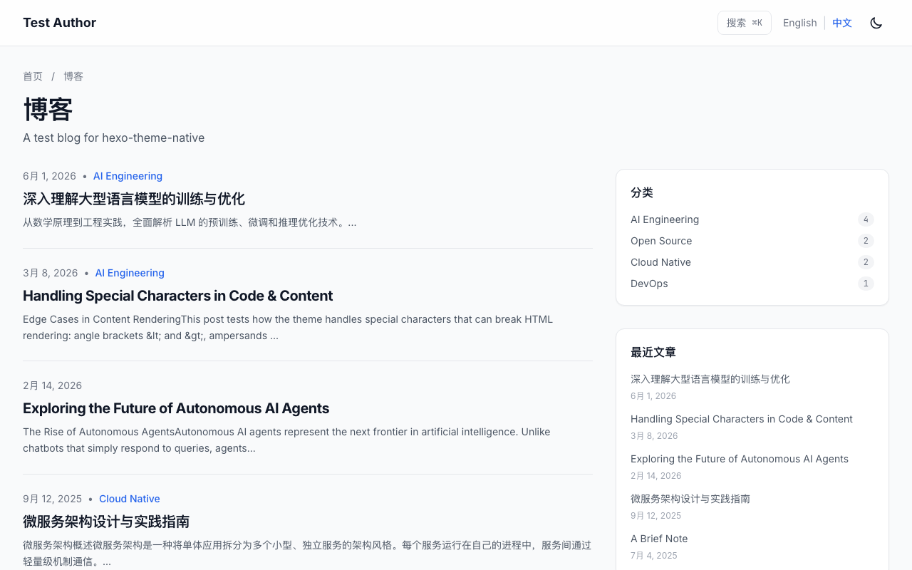
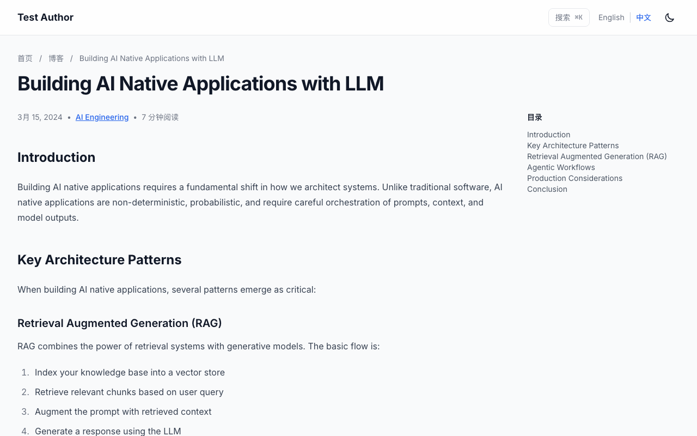

# hexo-theme-native

> [English](README.md) | [中文](README.zh-CN.md)

A modern, config-driven Hexo theme with a cloud-native / developer-centric aesthetic. Features a sticky mega-menu header, ⌘K search, dark mode, i18n, and a responsive two-column blog layout — all built with Tailwind CSS.

## Preview

### Desktop (Light)



### Article Detail Page



### Mobile


## Quick Start

### 1. Install the theme

Clone into your Hexo site's `themes/` directory:

```bash
cd your-hexo-site
git clone https://github.com/your-repo/hexo-theme-native.git themes/native
```

### 2. Install theme dependencies

```bash
cd themes/native
npm install
```

### 3. Install required Hexo plugins

In your Hexo site root:

```bash
npm install hexo-renderer-ejs hexo-generator-searchdb hexo-renderer-marked
```

### 4. Configure your site

In your site's `_config.yml`:

```yaml
theme: native

# Search plugin config
search:
  path: search.json
  field: post
  content: true
  format: html
```

### 5. Build the CSS

```bash
cd themes/native
npm run build:css
```

### 6. Run Hexo

```bash
hexo server   # dev
hexo generate # production
```

> **Note:** The theme auto-compiles CSS on `hexo generate` via a `generateBefore` hook. If `style.css` already exists and the build fails, it falls back to the existing file.

---

## Site-Side Plugin Requirements

| Plugin | Purpose |
|--------|---------|
| `hexo-renderer-ejs` | EJS template rendering |
| `hexo-generator-searchdb` | Generates `search.json` for ⌘K search |
| `hexo-renderer-marked` | Markdown rendering |

---

## Configuration

All configuration is in `themes/native/_config.yml`. Key sections:

### Announcement Bar

```yaml
announcement:
  enable: true
  text_key: "announcement_text"          # i18n key in languages/*.yml
  link: "/ai-native-infrastructure/"
  link_text_key: "announcement_link_text"
```

Set `enable: false` to hide.

### Navigation & Mega Menu

```yaml
navbar:
  logo: "/images/logo.svg"
  site_name: "My Blog"
  menu:
    - title: "Blog"
      url: "/blog/"
    - title: "Technology"       # dropdown item
      type: "dropdown"
      children:
        - name: "AI Engineering"
          desc: "LLM, AI Native Infra and Agentic AI."
          url: "/categories/ai-engineering/"
          icon: "cpu"           # matches _partial/icons/cpu.ejs
        - name: "External Link"
          desc: "Opens in new tab"
          url: "https://example.com"
          external: true
```

Available icons: `cpu`, `server`, `code`. To add more, create `layout/_partial/icons/<name>.ejs` with an inline SVG.

### Search

```yaml
search:
  enable: true
  shortcut: "⌘K"
  path: "search.json"
```

Search data is **lazy-loaded** — only fetched when the user opens the search modal or visits `/search/`, not on page load.

### Dark Mode

```yaml
theme_mode:
  default: "system"  # light | dark | system
```

The toggle cycles: **light → dark → system → light**. Preference is persisted in `localStorage`. `system` follows the OS `prefers-color-scheme` setting. An inline script in `<head>` prevents FOUC (flash of unstyled content).

### Blog List Page

```yaml
blog:
  title: "Blog"
  subtitle: "Your subtitle here"
  per_page: 10
  show_excerpt: true
  excerpt_length: 160
  reading_time: true
```

### Article Detail Page

```yaml
post:
  toc: false  # global default, per-article front-matter can override
```

To enable TOC for a specific post, add `toc: true` to its front-matter. The theme uses Hexo's native `toc()` helper — no external plugin needed. When a post has no headings, the layout automatically falls back to full-width single column.

### Math Rendering

```yaml
math:
  enable: false     # global, per-article front-matter `math: true` overrides
  engine: "mathjax"  # mathjax (recommended)
```

To enable math for a specific post:

```markdown
---
title: My Math Post
math: true
---
```

Uses MathJax 3 via CDN with `$...$` and `\(...\)` inline math syntax.

### Sidebar Widgets

```yaml
sidebar:
  widgets:
    - categories
    - recent
    - tags
```

Order determines display order. Available widgets: `categories`, `recent`, `tags`.

### Footer

```yaml
footer:
  columns:
    - title_key: "footer_nav"          # i18n key
      links:
        - name_key: "footer_blog_posts" # i18n key
          url: "/blog/"
  social_qr:
    - name: "LinkedIn"
      qr_image: "/images/linkedin-qr.png"
      link: "https://linkedin.com/in/you"
  copyright_year: "2024-2026"
  author: "Your Name"
  license: "CC BY 4.0"
  license_url: "https://creativecommons.org/licenses/by/4.0/"
  powered_by:
    - name: "Hexo"
      url: "https://hexo.io"
```

### i18n

```yaml
i18n:
  enable: true
  default_lang: "zh-CN"
  languages:
    - code: "en"
      name: "English"
    - code: "zh-CN"
      name: "中文"
```

All user-facing text uses i18n keys defined in `languages/en.yml` and `languages/zh-CN.yml`. To add a language, create `languages/<code>.yml` and add it to the `languages` list.

---

## Customization

### CSS

Edit `source/css/input.css` and rebuild:

```bash
npm run watch:css   # dev: auto-recompile on change
npm run build:css   # prod: minified output
```

The theme uses Tailwind CSS 3.4 with `@tailwindcss/typography` for article content (`.prose`). Custom component classes (pagination, code blocks) are in `@layer components` in `input.css`.

### Fonts

Inter (sans) and JetBrains Mono (mono) are loaded via Google Fonts in `head.ejs`. To use local fonts, download font files to `source/fonts/` and replace the `<link>` tags with `@font-face` declarations in `input.css`.

### Colors

The theme uses Tailwind's default color palette. Key colors:

| Element | Light | Dark |
|---------|-------|------|
| Background | `gray-50` | `gray-950` |
| Card | `white` | `gray-900` |
| Text | `gray-900` | `gray-50` |
| Accent | `blue-600` | `blue-400` |
| Border | `gray-200` | `gray-800` |

---

## Features

- **Sticky header** with mega-menu dropdowns (hover to expand)
- **⌘K / Ctrl+K search** — lazy-loaded, keyboard navigable (↑↓/Enter/Esc), XSS-safe
- **Dark mode** — 3-state toggle (light/dark/system), no FOUC, cross-tab sync
- **Responsive layout** — 8/4 two-column grid at `lg` (1024px), single column on mobile
- **Mobile drawer** — slide-in nav with accordion submenus, scroll lock, Esc to close
- **Article TOC** — auto-detected from headings, sticky sidebar, falls back to full-width when empty
- **Code blocks** — copy button, line-number support, dark-mode syntax highlighting
- **i18n** — English + Chinese out of the box, extensible
- **SEO** — Open Graph, Twitter Card, meta tags, cover image extraction
- **Math** — MathJax 3 conditional loading
- **a11y** — skip-to-content link, ARIA attributes, keyboard navigation, focus management

---

## Development

```bash
# Install dependencies
npm install

# Watch CSS during development
npm run watch:css

# Build minified CSS for production
npm run build:css
```

### Project Structure

```
hexo-theme-native/
├── _config.yml              # Theme config
├── package.json             # Build scripts + deps
├── tailwind.config.js       # Tailwind config
├── languages/               # i18n (en.yml, zh-CN.yml)
├── layout/                  # EJS templates
│   ├── layout.ejs           # HTML skeleton
│   ├── archive.ejs          # Blog list page
│   ├── post.ejs             # Article detail
│   ├── search.ejs           # Search page
│   ├── 404.ejs              # Error page
│   └── _partial/            # Reusable components
├── source/
│   ├── css/input.css        # Tailwind entry
│   ├── js/main.js           # Interactions
│   └── js/search.js         # Search logic
└── scripts/build-css.js     # Auto-build hook
```

---

## License

MIT
